# 🔄 Workflows Mermaid - Projet Hybrid CVRPTW Solver

## 1. Flux Global du Solveur Hybride

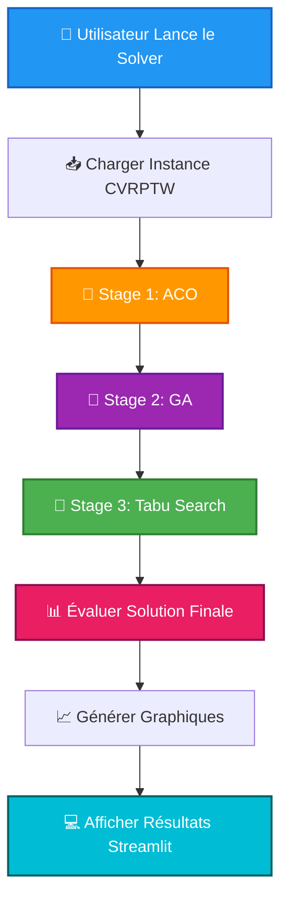

---

## 2. Détail Stage 1 : ACO (Ant Colony Optimization)

```mermaid
graph LR
    A["🚀 Démarrer ACO<br/>n_ants=10, iterations=5"] --> B["🔄 Pour chaque itération"]
    B --> C["🐜 Chaque fourmi construit<br/>une route"]
    C --> D{Client<br/>faisable?}
    D -->|Oui| E["✅ Ajouter au route<br/>Update capacité/temps"]
    D -->|Non| F["❌ Fermer route<br/>Retour au dépôt"]
    E --> G{Tous les<br/>clients visités?}
    G -->|Non| C
    G -->|Oui| H["📍 Route complète"]
    F --> H
    H --> I["📊 Évaluer fitness<br/>de la route"]
    I --> J["🔄 Itération suivante<br/>Fourmis 2..10"]
    J --> K{Toutes les<br/>fourmis?}
    K -->|Non| J
    K -->|Oui| L["🌊 Évaporer phéromones<br/>ρ = 0.1"]
    L --> M["💧 Renforcer bonnes routes<br/>τ += 1/distance"]
    M --> N{Itération<br/>suivante?}
    N -->|Oui| B
    N -->|Non| O["📋 Retourner liste solutions<br/>+ historique"]
    
    style A fill:#FF9800,stroke:#E65100,stroke-width:2px,color:#fff
    style C fill:#FFC107,stroke:#F57F17,stroke-width:2px,color:#000
    style E fill:#4CAF50,stroke:#2E7D32,stroke-width:2px,color:#fff
    style F fill:#FF5722,stroke:#BF360C,stroke-width:2px,color:#fff
    style M fill:#FFD54F,stroke:#F9A825,stroke-width:2px,color:#000
    style O fill:#FF7043,stroke:#D84315,stroke-width:2px,color:#fff
```

---

## 3. Détail Stage 2 : GA (Genetic Algorithm)

```mermaid
graph LR
    A["🧬 Démarrer GA<br/>pop_size=50, generations=50"] --> B["👥 Initialiser Population"]
    B --> C["📥 Solutions ACO<br/>+ Aléatoires"]
    C --> D["🔄 Pour chaque génération"]
    D --> E["🎲 Tournoi Sélection<br/>k=3"]
    E --> F["👨‍👩‍👧 Parent 1 + Parent 2"]
    F --> G["🔀 Crossover OX<br/>Ordered Crossover"]
    G --> H["👶 Enfant créé<br/>Combine traits P1+P2"]
    H --> I{Mutation?<br/>p=0.1}
    I -->|Oui| J["🔄 Swap deux clients<br/>au hasard"]
    I -->|Non| K["➡️ Enfant inchangé"]
    J --> K
    K --> L["📊 Évaluer fitness<br/>enfant"]
    L --> M["👑 Élitisme<br/>Garder meilleur"]
    M --> N["🆕 new_population += enfant"]
    N --> O{population<br/>complete?}
    O -->|Non| E
    O -->|Oui| P{Génération<br/>suivante?}
    P -->|Oui| D
    P -->|Non| Q["🏆 Retourner meilleure solution<br/>+ historique"]
    
    style A fill:#9C27B0,stroke:#6A1B9A,stroke-width:2px,color:#fff
    style C fill:#BA68C8,stroke:#7B1FA2,stroke-width:2px,color:#fff
    style G fill:#CE93D8,stroke:#8E24AA,stroke-width:2px,color:#fff
    style J fill:#E1BEE7,stroke:#8E24AA,stroke-width:2px,color:#000
    style M fill:#F3E5F5,stroke:#8E24AA,stroke-width:2px,color:#000
    style Q fill:#6A1B9A,stroke:#4A148C,stroke-width:2px,color:#fff
```

---

## 4. Détail Stage 3 : Tabu Search

```mermaid
graph LR
    A["🎯 Démarrer Tabu<br/>max_steps=50, tenure=10"] --> B["🎬 Solution initiale<br/>= Meilleur GA"]
    B --> C["🔄 Pour chaque étape"]
    C --> D["🏘️ Générer Voisinage<br/>50 mouvements"]
    D --> E["🔀 Relocate:<br/>Client d'une route<br/>à une autre"]
    E --> F["🔄 Swap:<br/>Deux clients<br/>échange"]
    F --> G["📊 Évaluer tous<br/>les voisins"]
    G --> H["🚫 Tabu List?<br/>Mouvement interdit?"]
    H -->|Oui| I{Aspiration<br/>Criteria?<br/>Meilleur global?}
    I -->|Oui| J["✅ Accepter<br/>malgré tabou"]
    I -->|Non| K["❌ Refuser<br/>Chercher suivant"]
    H -->|Non| L["✅ Accepter<br/>Meilleur voisin"]
    J --> M["📍 Déplacer vers<br/>ce voisin"]
    L --> M
    K --> N{Voisin<br/>suivant?}
    N -->|Oui| G
    N -->|Non| O["⚠️ Aucun voisin<br/>acceptable<br/>Étape échouée"]
    M --> P["🗂️ Ajouter move<br/>à tabu_list"]
    P --> Q["🔄 Supprimer moves<br/>> tabu_tenure"]
    Q --> R["👑 Track best ever<br/>si meilleur"]
    R --> S{Étape<br/>suivante?}
    S -->|Oui| C
    S -->|Non| T["🏁 Retourner meilleure solution<br/>trouvée + historique"]
    
    style A fill:#4CAF50,stroke:#2E7D32,stroke-width:2px,color:#fff
    style C fill:#81C784,stroke:#388E3C,stroke-width:2px,color:#fff
    style H fill:#FFC107,stroke:#F57F17,stroke-width:2px,color:#000
    style J fill:#A5D6A7,stroke:#388E3C,stroke-width:2px,color:#000
    style M fill:#66BB6A,stroke:#2E7D32,stroke-width:2px,color:#fff
    style T fill:#1B5E20,stroke:#1B5E20,stroke-width:2px,color:#fff
```

---

## 5. Flux Complet : Instance → Solution

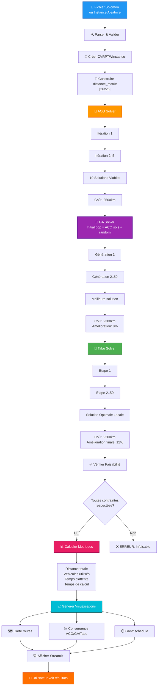

---

## 6. Cycle de Benchmarking


---

## 7. Arbre de Décision : Gestion des Contraintes

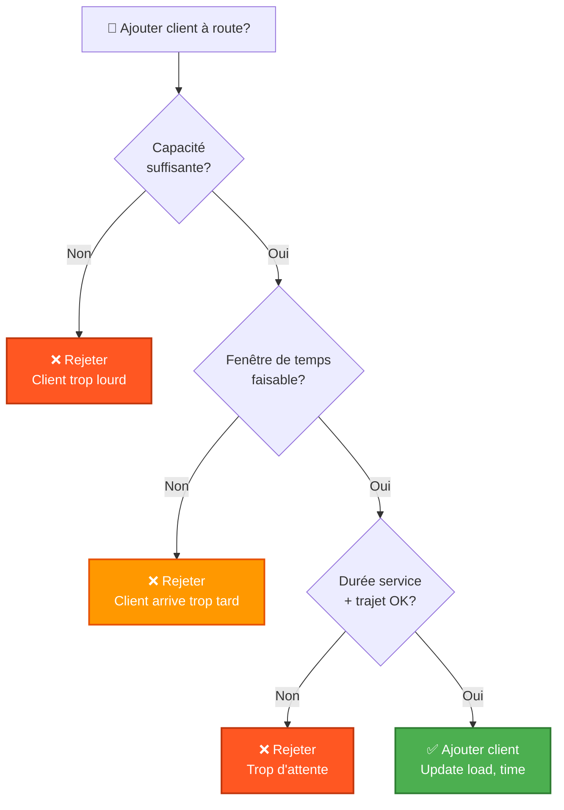

---

## 8. Structure de Données : Route

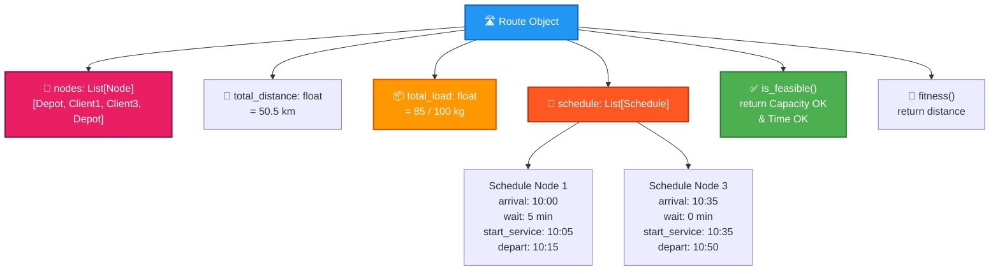

---

## 9. Matrice Distance et Calcul

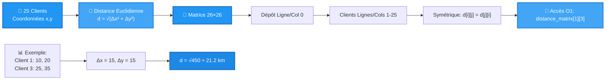

---

## 10. Pipeline d'Évaluation d'une Solution

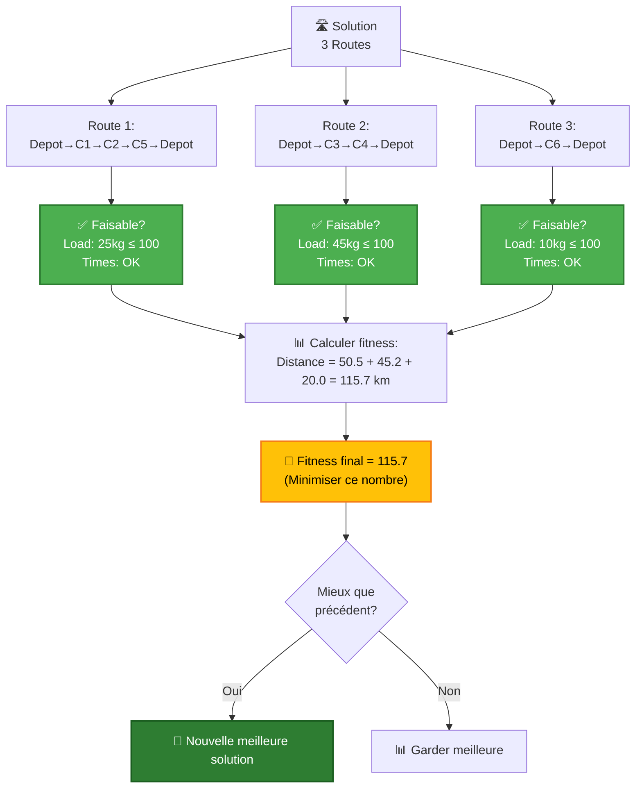

---

## 11. Boucle Principale : Hybrid Solver

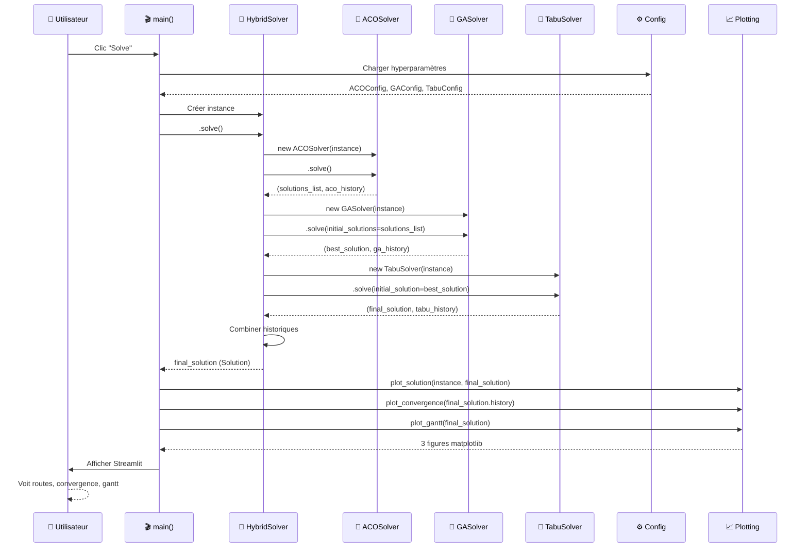

---

## 12. État-Transitions : Vie d'une Solution

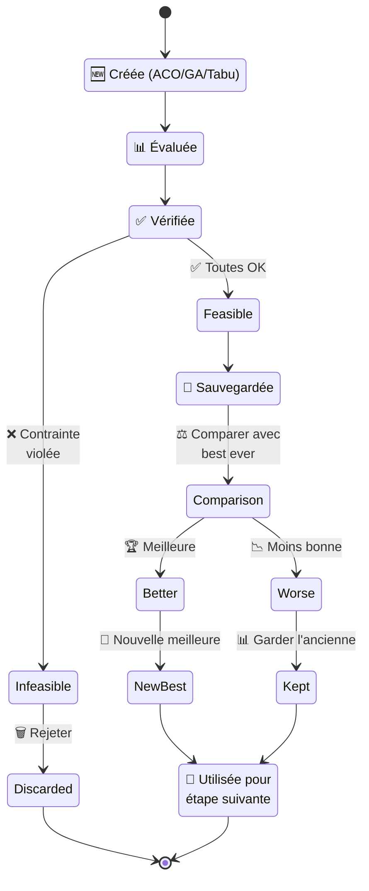

---

## 13. Dépendances et Imports

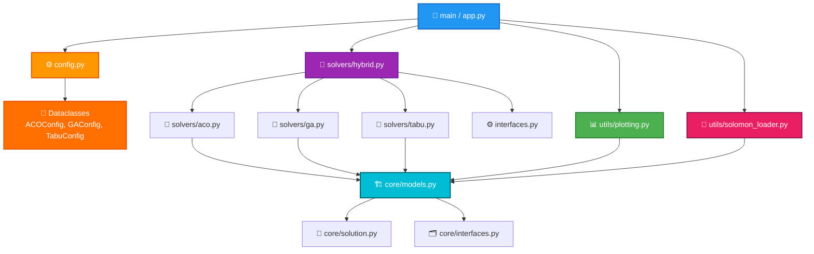

---

## 14. Exemple Concret : Résoudre Instance de 5 Clients

```mermaid
graph LR
    A["Instance<br/>5 Clients + Dépôt"] --> B["🐜 ACO It.1"]
    B --> B1["Fourmi 1<br/>0→1→3→0<br/>Dist: 100"]
    B --> B2["Fourmi 2<br/>0→2→4→0<br/>Dist: 120"]
    
    B1 --> C["Phéromone Update"]
    B2 --> C
    C --> C1["τ[0→1] ↑<br/>τ[0→2] ↑"]
    
    C1 --> D["🐜 ACO It.2"]
    D --> D1["Fourmi 1<br/>0→1→3→0<br/>Dist: 100"]
    D --> D2["Fourmi 2<br/>0→1→4→0<br/>Dist: 105<br/>(moins de phéro sur 0→2)"]
    
    D1 --> E["Solutions ACO<br/>= [Sol_100, Sol_105]"]
    
    E --> F["🧬 GA Gen.1"]
    F --> F1["Pop = Sol_100 + Sol_105<br/>+ 3 random"]
    
    F1 --> G["Crossover<br/>Parent: 0→1→3<br/>Parent: 0→1→4<br/>Child: 0→1→3→4"]
    G --> H["Mutation?<br/>Oui → Swap 1,3<br/>→ 0→3→1→4"]
    
    H --> I["GA Gen.50"]
    I --> J["Best Sol GA<br/>Dist: 95"]
    
    J --> K["🎯 Tabu Step 1"]
    K --> K1["Voisins:<br/>Swap 1↔3 → 98<br/>Relocate 4 → 92"]
    K1 --> L["Choose: 92<br/>Add swap to tabu"]
    L --> M["Tabu Step 50"]
    M --> N["Final Sol<br/>Dist: 88 ✅"]
    
    style A fill:#2196F3,stroke:#1565C0,stroke-width:2px,color:#fff
    style B fill:#42A5F5,stroke:#1976D2,stroke-width:2px,color:#fff
    style B1 fill:#1E88E5,stroke:#1565C0,stroke-width:2px,color:#fff
    style E fill:#4CAF50,stroke:#2E7D32,stroke-width:2px,color:#fff
    style F fill:#9C27B0,stroke:#6A1B9A,stroke-width:2px,color:#fff
    style J fill:#E91E63,stroke:#880E4F,stroke-width:2px,color:#fff
    style N fill:#FF6F00,stroke:#E65100,stroke-width:2px,color:#fff
```

---

## 15. Comparaison des 3 Algorithmes en Graphique

```mermaid
graph TD
    A["Comparaison ACO vs GA vs Tabu"]
    
    A --> B["Vitesse de Convergence"]
    B --> B1["ACO: Moyenne"]
    B --> B2["GA: Lente (populatiom)"]
    B --> B3["Tabu: Très rapide (local)"]
    
    A --> C["Exploration"]
    C --> C1["ACO: Bonne"]
    C --> C2["GA: Excellente (crossover)"]
    C --> C3["Tabu: Très locale"]
    
    A --> D["Qualité finale"]
    D --> D1["ACO: Moyenne"]
    D --> D2["GA: Bonne"]
    D --> D3["Tabu: Excellente si bien init"]
    
    A --> E["Sensibilité params"]
    E --> E1["ACO: ⚠️ Haute"]
    E --> E2["GA: ⚠️ Haute"]
    E --> E3["Tabu: ⚠️ Très haute"]
    
    A --> F["Avantage Hybrid"]
    F --> F1["ACO: Rapid start"]
    F --> F2["GA: Explore large"]
    F --> F3["Tabu: Polish final"]
    F --> F4["Combinés = 🏆 Meilleur résultat"]
    
    style A fill:#e3f2fd
    style B1 fill:#fff3e0
    style B2 fill:#f3e5f5
    style B3 fill:#e8f5e9
    style F4 fill:#c8e6c9,color:#000
```

---

## 📌 Comment lire ces diagrammes

### Pour Streamlit / Documentation
1. Copier les blocs Mermaid ci-dessus
2. Utiliser dans Streamlit : `st.markdown("```mermaid\n...\n```")`
3. Ou dans GitHub README : Mermaid s'affiche automatiquement

### Pour présentation PPT
1. Capturer en PNG depuis https://mermaid.live
2. Insérer dans slides

### Pour LaTeX / PDF
1. Utiliser `mermaid-cli` : `mmdc -i diagram.mmd -o diagram.png`
2. Inclure l'image

---

## 🎯 Résumé Visuel

| Diagramme | Usage |
|-----------|-------|
| #1 | Vue d'ensemble projet |
| #2 | Expliquer ACO au jury |
| #3 | Expliquer GA au jury |
| #4 | Expliquer Tabu au jury |
| #5 | Flux complet A→Z |
| #6 | Comment benchmark fonctionne |
| #7 | Contraintes CVRPTW |
| #8 | Structure interne Route |
| #9 | Calcul distance |
| #10 | Évaluation solution |
| #11 | Communication entre modules |
| #12 | Cycle de vie solution |
| #13 | Architecture code |
| #14 | Exemple concret petit |
| #15 | Comparaison algos |
