# 🔄 Workflows Mermaid - Hybrid CVRPTW Solver Project

## 1. Global Solver Workflow

```mermaid
graph TD
    A["👤 User Launches Solver"] --> B["📥 Load CVRPTW Instance"]
    B --> C["🐜 Stage 1: ACO"]
    C --> D["🧬 Stage 2: GA"]
    D --> E["🎯 Stage 3: Tabu Search"]
    E --> F["📊 Evaluate Final Solution"]
    F --> G["📈 Generate Graphics"]
    G --> H["💻 Display Streamlit Results"]
    
    style A fill:#2196F3,stroke:#1565C0,stroke-width:2px,color:#fff
    style C fill:#FF9800,stroke:#E65100,stroke-width:2px,color:#fff
    style D fill:#9C27B0,stroke:#6A1B9A,stroke-width:2px,color:#fff
    style E fill:#4CAF50,stroke:#2E7D32,stroke-width:2px,color:#fff
    style F fill:#E91E63,stroke:#880E4F,stroke-width:2px,color:#fff
    style H fill:#00BCD4,stroke:#006064,stroke-width:2px,color:#fff
```

---

## 2. Stage 1 Details: ACO (Ant Colony Optimization)

```mermaid
graph LR
    A["🚀 Start ACO<br/>n_ants=10, iterations=5"] --> B["🔄 For each iteration"]
    B --> C["🐜 Each ant builds<br/>a route"]
    C --> D{Feasible<br/>client?}
    D -->|Yes| E["✅ Add to route<br/>Update capacity/time"]
    D -->|No| F["❌ Close route<br/>Return to depot"]
    E --> G{All clients<br/>visited?}
    G -->|No| C
    G -->|Yes| H["📍 Route complete"]
    F --> H
    H --> I["📊 Evaluate route<br/>fitness"]
    I --> J["🔄 Next iteration<br/>Ants 2..10"]
    J --> K{All ants<br/>done?}
    K -->|No| J
    K -->|Yes| L["🌊 Evaporate pheromones<br/>ρ = 0.1"]
    L --> M["💧 Reinforce good routes<br/>τ += 1/distance"]
    M --> N{Next<br/>iteration?}
    N -->|Yes| B
    N -->|No| O["📋 Return solutions list<br/>+ history"]
    
    style A fill:#FF9800,stroke:#E65100,stroke-width:2px,color:#fff
    style C fill:#FFC107,stroke:#F57F17,stroke-width:2px,color:#000
    style E fill:#4CAF50,stroke:#2E7D32,stroke-width:2px,color:#fff
    style F fill:#FF5722,stroke:#BF360C,stroke-width:2px,color:#fff
    style M fill:#FFD54F,stroke:#F9A825,stroke-width:2px,color:#000
    style O fill:#FF7043,stroke:#D84315,stroke-width:2px,color:#fff
```

---

## 3. Stage 2 Details: GA (Genetic Algorithm)


---

## 4. Stage 3 Details: Tabu Search


---

## 5. Complete Flow: Instance → Solution

```mermaid
graph TD
    A["📂 Solomon File<br/>or Random Instance"] --> B["🔍 Parse & Validate"]
    B --> C["📍 Create CVRPTWInstance"]
    C --> D["🧮 Build distance_matrix<br/>[26x26]"]
    
    D --> E["🐜 ACO Solver"]
    E --> E1["Iteration 1"]
    E1 --> E2["Iteration 2..5"]
    E2 --> E3["10 Viable Solutions"]
    E3 --> F["Cost: 2500km"]
    
    F --> G["🧬 GA Solver<br/>Initial pop = ACO sols + random"]
    G --> G1["Generation 1"]
    G1 --> G2["Generation 2..50"]
    G2 --> G3["Best solution"]
    G3 --> H["Cost: 2300km<br/>Improvement: 8%"]
    
    H --> I["🎯 Tabu Solver"]
    I --> I1["Step 1"]
    I1 --> I2["Step 2..50"]
    I2 --> I3["Local Optimal Solution"]
    I3 --> J["Cost: 2200km<br/>Final improvement: 12%"]
    
    J --> K["✅ Check Feasibility"]
    K --> L{All constraints<br/>respected?}
    L -->|Yes| M["📊 Calculate Metrics"]
    L -->|No| N["❌ ERROR: Infeasible"]
    
    M --> O["Total distance<br/>Vehicles used<br/>Wait time<br/>Computation time"]
    O --> P["📈 Generate Visualizations"]
    P --> Q["🗺️ Routes map"]
    P --> R["📉 Convergence ACO/GA/Tabu"]
    P --> S["⏱️ Gantt schedule"]
    
    Q --> T["💻 Display Streamlit"]
    R --> T
    S --> T
    T --> U["👤 User sees results"]
    
    style A fill:#2196F3,stroke:#1565C0,stroke-width:2px,color:#fff
    style E fill:#FF9800,stroke:#E65100,stroke-width:2px,color:#fff
    style G fill:#9C27B0,stroke:#6A1B9A,stroke-width:2px,color:#fff
    style I fill:#4CAF50,stroke:#2E7D32,stroke-width:2px,color:#fff
    style M fill:#E91E63,stroke:#880E4F,stroke-width:2px,color:#fff
    style P fill:#00BCD4,stroke:#006064,stroke-width:2px,color:#fff
    style U fill:#FF6F00,stroke:#E65100,stroke-width:2px,color:#fff
```

---

## 6. Benchmarking Cycle

```mermaid
graph LR
    A["📋 Benchmarks Page<br/>Streamlit"] --> B["🗂️ Load Solomon files<br/>c101, r101, rc101.."]
    B --> C["🎚️ Select parameters<br/>ants=10, gens=50, steps=50"]
    C --> D["🔄 Loop for each instance"]
    D --> E["🔁 Run 1"]
    E --> F["Instance → Hybrid Solver<br/>→ Solution 1"]
    F --> G["📊 Record:<br/>cost, time, vehicles, feasible"]
    G --> H["🔁 Run 2..5"]
    H --> I["5 Results for c101"]
    I --> J["📈 Calculate statistics<br/>best, avg, std"]
    J --> K["🔄 Next instance<br/>r101, rc101.."]
    K --> L["📊 Final table<br/>10+ instances"]
    L --> M["💾 Export CSV"]
    M --> N["📥 Download results"]
    
    style A fill:#2196F3,stroke:#1565C0,stroke-width:2px,color:#fff
    style D fill:#FF9800,stroke:#E65100,stroke-width:2px,color:#fff
    style E fill:#9C27B0,stroke:#6A1B9A,stroke-width:2px,color:#fff
    style I fill:#4CAF50,stroke:#2E7D32,stroke-width:2px,color:#fff
    style M fill:#FFD54F,stroke:#F9A825,stroke-width:2px,color:#000
    style N fill:#FF7043,stroke:#D84315,stroke-width:2px,color:#fff
```

---

## 7. Decision Tree: Constraint Management

```mermaid
graph TD
    A["🚛 Add client to route?"] --> B{"Capacity<br/>sufficient?"}
    B -->|No| C["❌ Reject<br/>Client too heavy"]
    B -->|Yes| D{"Time window<br/>feasible?"}
    D -->|No| E["❌ Reject<br/>Client arrives too late"]
    D -->|Yes| F{"Service duration<br/>+ travel OK?"}
    F -->|No| G["❌ Reject<br/>Too much waiting"]
    F -->|Yes| H["✅ Add client<br/>Update load, time"]
    
    style C fill:#FF5722,stroke:#BF360C,stroke-width:2px,color:#fff
    style E fill:#FF9800,stroke:#E65100,stroke-width:2px,color:#fff
    style G fill:#FF5722,stroke:#BF360C,stroke-width:2px,color:#fff
    style H fill:#4CAF50,stroke:#2E7D32,stroke-width:2px,color:#fff
```

---

## 8. Data Structure: Route

```mermaid
graph TD
    A["🛣️ Route Object"] --> B["📍 nodes: List[Node]<br/>[Depot, Client1, Client3, Depot]"]
    A --> C["📐 total_distance: float<br/>= 50.5 km"]
    A --> D["📦 total_load: float<br/>= 85 / 100 kg"]
    A --> E["📅 schedule: List[Schedule]"]
    E --> E1["Schedule Node 1<br/>arrival: 10:00<br/>wait: 5 min<br/>start_service: 10:05<br/>depart: 10:15"]
    E --> E2["Schedule Node 3<br/>arrival: 10:35<br/>wait: 0 min<br/>start_service: 10:35<br/>depart: 10:50"]
    A --> F["✅ is_feasible()<br/>return Capacity OK<br/>& Time OK"]
    A --> G["🎯 fitness()<br/>return distance"]
    
    style A fill:#2196F3,stroke:#1565C0,stroke-width:2px,color:#fff
    style B fill:#42A5F5,stroke:#1976D2,stroke-width:2px,color:#fff
    style C fill:#2196F3,stroke:#1565C0,stroke-width:2px,color:#fff
    style G fill:#1E88E5,stroke:#1565C0,stroke-width:2px,color:#fff
    style J fill:#1976D2,stroke:#1565C0,stroke-width:2px,color:#fff
```

---

## 9. Distance Matrix and Calculation


---

## 10. Solution Evaluation Pipeline

```mermaid
graph TD
    A["🛣️ Solution<br/>3 Routes"] --> B["Route 1:<br/>Depot→C1→C2→C5→Depot"]
    A --> C["Route 2:<br/>Depot→C3→C4→Depot"]
    A --> D["Route 3:<br/>Depot→C6→Depot"]
    
    B --> B1["✅ Feasible?<br/>Load: 25kg ≤ 100<br/>Times: OK"]
    C --> C1["✅ Feasible?<br/>Load: 45kg ≤ 100<br/>Times: OK"]
    D --> D1["✅ Feasible?<br/>Load: 10kg ≤ 100<br/>Times: OK"]
    
    B1 --> E["📊 Calculate fitness:<br/>Distance = 50.5 + 45.2 + 20.0 = 115.7 km"]
    C1 --> E
    D1 --> E
    
    E --> F["🎯 Final fitness = 115.7<br/>(Minimize this number)"]
    F --> G{Better than<br/>previous?}
    G -->|Yes| H["👑 New best solution"]
    G -->|No| I["📊 Keep best"]
    
    style B1 fill:#4CAF50,stroke:#2E7D32,stroke-width:2px,color:#fff
    style C1 fill:#4CAF50,stroke:#2E7D32,stroke-width:2px,color:#fff
    style D1 fill:#4CAF50,stroke:#2E7D32,stroke-width:2px,color:#fff
    style F fill:#FFC107,stroke:#F57F17,stroke-width:2px,color:#000
    style H fill:#2E7D32,stroke:#1B5E20,stroke-width:2px,color:#fff
```

---

## 11. Main Loop: Hybrid Solver

```mermaid
sequenceDiagram
    participant User as 👤 User
    participant Main as 🎬 main()
    participant Hybrid as 🔗 HybridSolver
    participant ACO as 🐜 ACOSolver
    participant GA as 🧬 GASolver
    participant Tabu as 🎯 TabuSolver
    participant Config as ⚙️ Config
    participant Plot as 📈 Plotting
    
    User->>Main: Click "Solve"
    Main->>Config: Load hyperparameters
    Config-->>Main: ACOConfig, GAConfig, TabuConfig
    
    Main->>Hybrid: Create instance
    Main->>Hybrid: .solve()
    
    Hybrid->>ACO: new ACOSolver(instance)
    Hybrid->>ACO: .solve()
    ACO-->>Hybrid: (solutions_list, aco_history)
    
    Hybrid->>GA: new GASolver(instance)
    Hybrid->>GA: .solve(initial_solutions=solutions_list)
    GA-->>Hybrid: (best_solution, ga_history)
    
    Hybrid->>Tabu: new TabuSolver(instance)
    Hybrid->>Tabu: .solve(initial_solution=best_solution)
    Tabu-->>Hybrid: (final_solution, tabu_history)
    
    Hybrid->>Hybrid: Combine histories
    Hybrid-->>Main: final_solution (Solution)
    
    Main->>Plot: plot_solution(instance, final_solution)
    Main->>Plot: plot_convergence(final_solution.history)
    Main->>Plot: plot_gantt(final_solution)
    
    Plot-->>Main: 3 matplotlib figures
    Main->>User: Display Streamlit
    
    User-->>User: See routes, convergence, gantt
```

---

## 12. State-Transitions: Solution Lifecycle

```mermaid
stateDiagram-v2
    [*] --> Generation
    
    Generation: 🆕 Created (ACO/GA/Tabu)
    Evaluation: 📊 Evaluated
    Feasibility: ✅ Verified
    Stored: 💾 Saved
    
    Generation --> Evaluation
    Evaluation --> Feasibility
    
    Feasibility --> Infeasible: ❌ Constraint<br/>violated
    Feasibility --> Feasible: ✅ All OK
    
    Infeasible --> Discarded: 🗑️ Reject
    Discarded --> [*]
    
    Feasible --> Stored
    Stored --> Comparison: ⚖️ Compare with<br/>best ever
    
    Comparison --> Better: 🏆 Better
    Comparison --> Worse: 📉 Worse
    
    Better --> NewBest: 👑 New best
    Worse --> Kept: 📊 Keep old
    
    NewBest --> Evolution
    Kept --> Evolution
    
    Evolution: 🔄 Used for<br/>next step
    Evolution --> [*]
```

---

## 13. Dependencies and Imports

```mermaid
graph TD
    A["🎯 main / app.py"]
    
    A --> B["⚙️ config.py"]
    A --> C["🔗 solvers/hybrid.py"]
    A --> D["📊 utils/plotting.py"]
    A --> E["📂 utils/solomon_loader.py"]
    
    C --> C1["🐜 solvers/aco.py"]
    C --> C2["🧬 solvers/ga.py"]
    C --> C3["🎯 solvers/tabu.py"]
    C --> C4["⚙️ interfaces.py"]
    
    C1 --> F["🏗️ core/models.py"]
    C2 --> F
    C3 --> F
    F --> G["💾 core/solution.py"]
    F --> H["🗂️ core/interfaces.py"]
    
    D --> F
    E --> F
    
    B --> I["🔧 Dataclasses<br/>ACOConfig, GAConfig, TabuConfig"]
    
    style A fill:#2196F3,stroke:#1565C0,stroke-width:2px,color:#fff
    style B fill:#FF9800,stroke:#E65100,stroke-width:2px,color:#fff
    style C fill:#9C27B0,stroke:#6A1B9A,stroke-width:2px,color:#fff
    style D fill:#4CAF50,stroke:#2E7D32,stroke-width:2px,color:#fff
    style E fill:#E91E63,stroke:#880E4F,stroke-width:2px,color:#fff
    style F fill:#00BCD4,stroke:#006064,stroke-width:2px,color:#fff
    style I fill:#FF6F00,stroke:#E65100,stroke-width:2px,color:#fff
```

---

## 14. Concrete Example: Solving 5-Client Instance

```mermaid
graph LR
    A["Instance<br/>5 Clients + Depot"] --> B["🐜 ACO It.1"]
    B --> B1["Ant 1<br/>0→1→3→0<br/>Dist: 100"]
    B --> B2["Ant 2<br/>0→2→4→0<br/>Dist: 120"]
    
    B1 --> C["Pheromone Update"]
    B2 --> C
    C --> C1["τ[0→1] ↑<br/>τ[0→2] ↑"]
    
    C1 --> D["🐜 ACO It.2"]
    D --> D1["Ant 1<br/>0→1→3→0<br/>Dist: 100"]
    D --> D2["Ant 2<br/>0→1→4→0<br/>Dist: 105<br/>(less pheromone on 0→2)"]
    
    D1 --> E["ACO Solutions<br/>= [Sol_100, Sol_105]"]
    
    E --> F["🧬 GA Gen.1"]
    F --> F1["Pop = Sol_100 + Sol_105<br/>+ 3 random"]
    
    F1 --> G["Crossover<br/>Parent: 0→1→3<br/>Parent: 0→1→4<br/>Child: 0→1→3→4"]
    G --> H["Mutation?<br/>Yes → Swap 1,3<br/>→ 0→3→1→4"]
    
    H --> I["GA Gen.50"]
    I --> J["Best Sol GA<br/>Dist: 95"]
    
    J --> K["🎯 Tabu Step 1"]
    K --> K1["Neighbors:<br/>Swap 1↔3 → 98<br/>Relocate 4 → 92"]
    K1 --> L["Choose: 92<br/>Add swap to tabu"]
    L --> M["Tabu Step 50"]
    M --> N["Final Sol<br/>Dist: 88 ✅"]
    
    style A fill:#2196F3,stroke:#1565C0,stroke-width:2px,color:#fff
    style B fill:#FF9800,stroke:#E65100,stroke-width:2px,color:#fff
    style B1 fill:#FFC107,stroke:#F57F17,stroke-width:2px,color:#000
    style E fill:#4CAF50,stroke:#2E7D32,stroke-width:2px,color:#fff
    style F fill:#9C27B0,stroke:#6A1B9A,stroke-width:2px,color:#fff
    style J fill:#E91E63,stroke:#880E4F,stroke-width:2px,color:#fff
    style N fill:#FF6F00,stroke:#E65100,stroke-width:2px,color:#fff
```

---

## 15. Algorithm Comparison

```mermaid
graph TD
    A["Comparison ACO vs GA vs Tabu"]
    
    A --> B["Convergence Speed"]
    B --> B1["ACO: Medium"]
    B --> B2["GA: Slow (population)"]
    B --> B3["Tabu: Very fast (local)"]
    
    A --> C["Exploration"]
    C --> C1["ACO: Good"]
    C --> C2["GA: Excellent (crossover)"]
    C --> C3["Tabu: Very local"]
    
    A --> D["Final Quality"]
    D --> D1["ACO: Medium"]
    D --> D2["GA: Good"]
    D --> D3["Tabu: Excellent if well initialized"]
    
    A --> E["Parameter Sensitivity"]
    E --> E1["ACO: ⚠️ High"]
    E --> E2["GA: ⚠️ High"]
    E --> E3["Tabu: ⚠️ Very high"]
    
    A --> F["Hybrid Advantage"]
    F --> F1["ACO: Rapid start"]
    F --> F2["GA: Explore widely"]
    F --> F3["Tabu: Polish final"]
    F --> F4["Combined = 🏆 Best result"]
    
    style A fill:#2196F3,stroke:#1565C0,stroke-width:2px,color:#fff
    style B1 fill:#FF9800,stroke:#E65100,stroke-width:2px,color:#fff
    style B2 fill:#9C27B0,stroke:#6A1B9A,stroke-width:2px,color:#fff
    style B3 fill:#4CAF50,stroke:#2E7D32,stroke-width:2px,color:#fff
    style F4 fill:#FF6F00,stroke:#E65100,stroke-width:2px,color:#fff
```

---

## 📌 How to Read These Diagrams

### For Streamlit / Documentation
1. Copy Mermaid blocks above
2. Use in Streamlit: `st.markdown("```mermaid\n...\n```")`
3. Or in GitHub README: Mermaid renders automatically

### For PowerPoint Presentation
1. Capture as PNG from https://mermaid.live
2. Insert into slides

### For LaTeX / PDF
1. Use `mermaid-cli`: `mmdc -i diagram.mmd -o diagram.png`
2. Include image

---

## 🎯 Visual Summary

| Diagram | Usage |
|---------|-------|
| #1 | Project overview |
| #2 | Explain ACO to jury |
| #3 | Explain GA to jury |
| #4 | Explain Tabu to jury |
| #5 | Complete flow A→Z |
| #6 | How benchmarking works |
| #7 | CVRPTW constraints |
| #8 | Route internal structure |
| #9 | Distance calculation |
| #10 | Solution evaluation |
| #11 | Communication between modules |
| #12 | Solution lifecycle |
| #13 | Code architecture |
| #14 | Concrete small example |
| #15 | Algorithm comparison |
